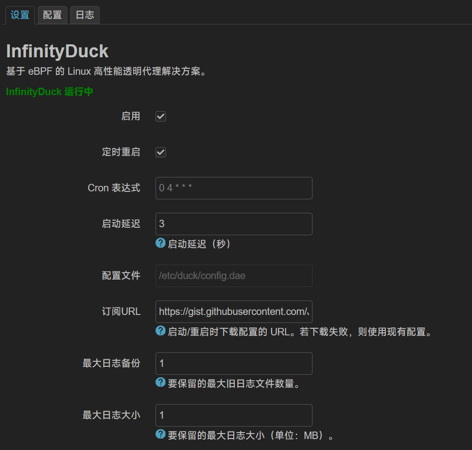
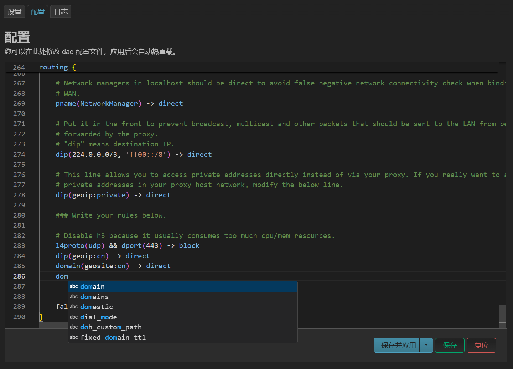
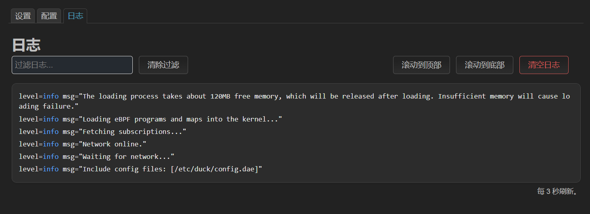

<div align="center">

# InfinityDuck
This project is based on [luci-app-dae](https://github.com/immortalwrt/luci/tree/master/applications/luci-app-dae), originally maintained by [Tianling Shen](https://github.com/1715173329).

</p><br>
</div>

## New Features:
- Powerful config editor provided by monaco-editor
- Latest commit version of dae core
- Reversed log order with scrollbar
- Log highlighting and filtering
- Simple config file validation
- Fetch config from remote
- Startup deplay
- Schedule restart

## Install
1. Add feed
```shell
# only needs to be run once
curl -s -L https://github.com/JohnsonRan/InfinitySubstance/raw/main/feed.sh | ash
```

2. Install
```shell
# you can install from shell or `Software` menu in LuCI
# for opkg
opkg install duck
opkg install luci-app-duck
opkg install luci-i18n-duck-zh-cn
# for apk
apk add --allow-untrusted duck
apk add --allow-untrusted luci-app-duck
apk add --allow-untrusted luci-i18n-duck-zh-cn
```

## Compilation
1. Install dependencies
```
apt update
apt install -y clang-19 llvm-19
```
2. Enable eBPF support, add below to `.config`:
```
CONFIG_DEVEL=y
CONFIG_KERNEL_DEBUG_INFO=y
CONFIG_KERNEL_DEBUG_INFO_REDUCED=n
CONFIG_KERNEL_DEBUG_INFO_BTF=y
CONFIG_KERNEL_CGROUPS=y
CONFIG_KERNEL_CGROUP_BPF=y
CONFIG_KERNEL_BPF_EVENTS=y
CONFIG_BPF_TOOLCHAIN_HOST=y
CONFIG_KERNEL_XDP_SOCKETS=y
CONFIG_PACKAGE_kmod-xdp-sockets-diag=y
```
3. Build InfinityDuck
```
git clone https://github.com/JohnsonRan/InfinityDuck package/new/InfinityDuck
make package/new/InfinityDuck/luci-app-duck/compile
```
- Or you can try [this](https://github.com/JohnsonRan/opwrt_build_script/releases) prebuilt firmware if you are using **x86_64** or **NanoPi R5S**
## Special Thanks
- [Percy Ma](https://marketplace.visualstudio.com/items?itemName=kecrily.dae)
- [Tianling Shen](https://github.com/1715173329)
- [morytyann](http://github.com/morytyann)
- [AopisL](https://github.com/apoiston)
- Claude 3.7 Sonnet  
And more...

## Screenshots
<details>
 <p>
  
  
  
 </p>
</details>
